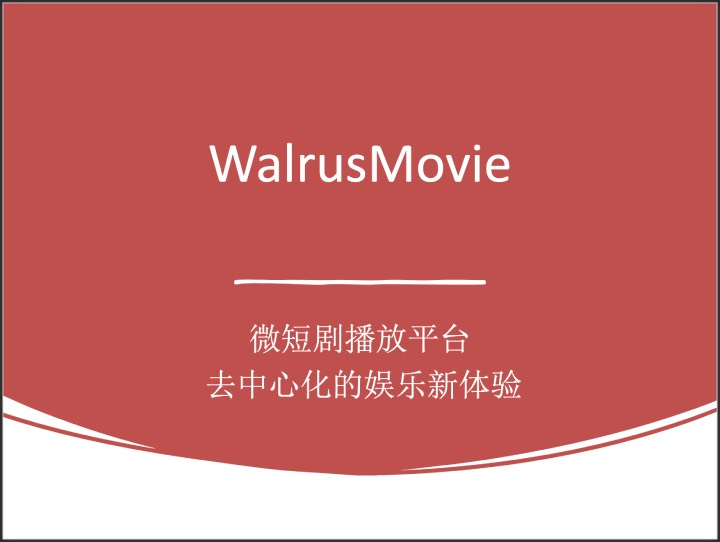

# WalrusMovie 微短剧播放平台

## **平台定位与独特卖点**

1. **去中心化的创作者经济：**
    - 强调通过区块链和智能合约技术，实现制片人与观众之间直接互动，省去中间商。
    - 采用透明的收益分配机制，增强制片人的创作动力。

2. **创新微短剧体验：**
    - 提供沉浸式观影功能，如剧集互动选项（类似"多结局剧情"）。
    - 支持多语言字幕与配音自动化服务，吸引全球观众。

3. **社区化运营：**
    - 通过引入观众评分、互动评论、粉丝打赏等社交功能，构建平台用户社区。

---

## **盈利与增长策略**

1. **多元化付费模式：**
    - 单集购买 vs 系列打包订阅。
    - 按月/年订阅会员，享受无限观看特权。
    - 引入“增值服务”，如剧集独家幕后花絮或导演剪辑版。

2. **广告收入：**
    - 提供非侵入式广告形式，如开场短片赞助、片尾动态插入。

3. **平台代币激励：**
    - 用户可通过观看、分享、好评等互动行为赚取平台专属代币，用于兑换短剧或优惠权益。

---

## **技术实现**

### **1. 分布式存储**
采用Walrus作为分布式存储基础，利用Walrus的特性确保内容安全性和数据传输的高效性。

### **2. Wormhole整合**
利用其跨链桥功能，支持多种主流加密货币（如USDT、BTC、ETH）支付，并实现与Sui平台内代币的无缝兑换。

### **3. 智能合约**
开发基于Sui Move语言的智能合约，实现用户支付和收益分配的自动化。

---

## 计划与愿景

### **1. 用户体验优化**
- **短剧智能推荐：**
  利用AI算法分析观众观影偏好，提供个性化推荐，提升平台活跃度。
- **离线功能：**
  支持用户通过本地缓存观看已订阅的短剧，增强用户粘性。

### **2. 制片人支持功能**
- **剧集分析工具：**
  提供数据可视化面板，帮助制片人了解其剧集播放量、订阅趋势及用户反馈。
- **版权保护机制：**
  通过区块链技术，给每部剧集的IP版权打上独立标识，防止盗版。

### **3. 多渠道支持**
- **多终端适配：**
  除Telegram DApp外，推出移动端App及Web端应用，覆盖更广泛的用户场景。
- **社交网络整合：**
  支持与其他主流社交媒体平台（如Instagram、TikTok）联动，扩大内容传播。

---

## **风险与挑战**

1. **版权合规性：**  
   需制定严格的内容上传与审核流程，避免侵犯版权问题。

2. **用户教育：**  
   去中心化与区块链技术对大众而言相对复杂，需要设计简单直观的交互界面，并通过教程引导新用户。

3. **竞争压力：**  
   面对传统流媒体平台（如YouTube、Netflix）和Web3视频平台的竞争，需通过独特的分发模式与用户体验建立差异化优势。

---

### **愿景总结**

WalrusMovie 致力于成为微短剧领域的先行者，通过去中心化技术赋能创作者与观众，打造一个开放、透明、创新的微短剧播放与交易平台。

Website: https://jv9fto2rvc2u8opxa84p5e4t2ldh9ayf5wdp38s5fahccrf9k.walrus.site

Mail: bc443995@gmail.com
